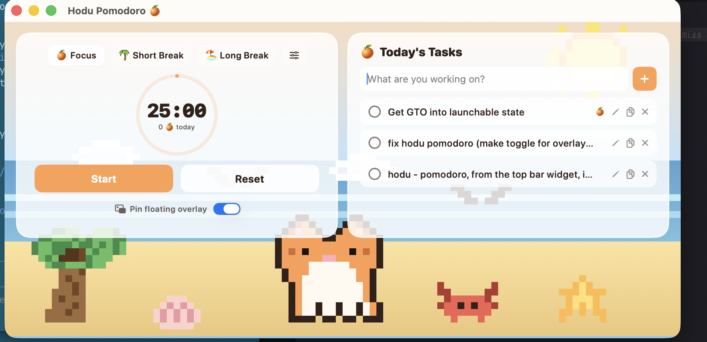
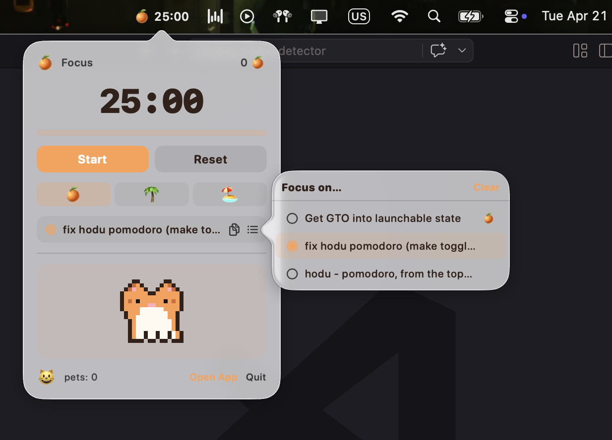

# 🍊 Hodu Pomodoro

A cute, bit-graphic pomodoro timer for macOS starring **Hodu** — an orange cat
with a white belly, sitting on a beach. Native SwiftUI app. Runs fully offline.
Tasks, settings, and history persist in `~/Library/Application Support/HoduPomodoro/`.




## Quick start

```bash
git clone <this-repo> hodu-pomodoro
cd hodu-pomodoro
./build.sh
open HoduPomodoro.app
```

First run may be blocked by Gatekeeper (the app isn't code-signed). If so,
right-click `HoduPomodoro.app` → **Open** → **Open** in the confirmation
dialog. You only have to do this once.

To install it properly, drag `HoduPomodoro.app` into `/Applications`.

**Requirements:** macOS 13 (Ventura) or newer, and the Xcode command-line
tools (`xcode-select --install`). No other dependencies.

## Features

- 🍊 **Pomodoro timer** — Focus, Short Break, Long Break. Auto-switches
  between work and breaks, with a long break every N completed focus
  sessions (configurable).
- ⚙️ **Custom durations** — click the slider icon next to the mode pills to
  open the settings popover. Adjust Focus / Short Break / Long Break minutes
  and cycles-until-long-break with steppers. Defaults shown as a guide, and
  a one-click "Reset to defaults".
- ✅ **Things-style task organizer**
  - Capture tasks into **Inbox**, then plan them into **Today**, **Upcoming**,
    **Anytime**, or **Someday**.
  - **Today** is split into **Now** and **This Evening** so later tasks stay
    out of the current focus lane.
  - Add lightweight **Areas**, **Projects**, notes, and deadlines from each
    task's info button.
  - Use **Quick Find** to filter the current list by title, notes, area, or
    project.
  - Move tasks quickly from the calendar button or row context menu.
  - Click a task to set it as the active Pomodoro focus target.
  - **Double-click** (or click the ✎ pencil) to edit a task title inline.
  - Checking a task off moves it into **Logbook** history.
  - Every completed focus session adds a 🍊 next to the active task.
- 🪟 **Floating mini-widget** — press **⇧⌘M** (or click "Minimize to
  floating widget") to collapse into a small always-on-top widget at the top
  of the screen. The widget **auto-hides** when the main window is focused
  and **re-appears** when it isn't, so it's only in the way when you want
  it. Draggable. Stays visible over fullscreen apps.
- 🐈 **Interactive cat** — Hodu is a mini-tamagotchi on the widget (and
  inside the menu bar popover). Click him to pet; hearts float up, he
  wiggles and purrs (♪), and his mood emoji improves: 😿 → 🙂 → 😺 → 😽.
  Happiness slowly decays, so he wants a little attention now and then.
  He blinks on his own every few seconds, and a ✨ follows your cursor
  while hovering.
- 🏖️ **Pixel-art beach scene** — hand-drawn Hodu, a palm tree, sun,
  clouds, seagulls, crab, scallop shell, and starfish. Rendered through
  SwiftUI `Canvas`, so it stays crisp at any window size.
- 🔔 Plays the system "Glass" chime when a session ends.

## Keyboard shortcuts

| Shortcut  | Action                        |
|-----------|-------------------------------|
| ⇧⌘M       | Minimize to floating widget   |
| ⌘Q        | Quit                          |

Standard macOS window shortcuts (⌘W, ⌘M, etc.) work too.

## Where your data lives

```
~/Library/Application Support/HoduPomodoro/
  tasks.json       tasks, schedule buckets, areas/projects, notes, deadlines
  settings.json    durations + cycles
  history.json     last 10 completed tasks
```

Delete the folder to wipe state.

## Project layout

```
Sources/HoduPomodoro/
  HoduApp.swift       @main entry, AppDelegate (status item + floating panel)
  ContentView.swift   TimerPanel, TaskListPanel, widget views, duration settings
  AppState.swift      timer engine, tasks, persistence, cat interaction, rollover
  Models.swift        TimerMode, TodoItem, Settings, HeartPop
  PixelArt.swift      sprite definitions + PixelSpriteView renderer
  BeachScene.swift    composed pixel-art background
Resources/Info.plist  bundle metadata
Resources/AppIcon.icns
build.sh              swift build + .app bundle assembly
```

### How the pixel art works

Each sprite is encoded as an array of strings. Every character is a palette
index, `.` means transparent. A SwiftUI `Canvas` fills one `CGRect` per
pixel, scaled by the current window size — so the art stays sharp when you
resize the window. To tweak Hodu, edit `Sprites.hodu` in `PixelArt.swift`.

## Why Swift + SwiftUI

- Truly native `.app` bundle, no runtime, no bundled browser.
- Tiny executable (~1 MB) that launches instantly.
- `Canvas` + `GeometryReader` make crisp pixel-art rendering trivial,
  with zero image assets to ship.

## License

MIT.
